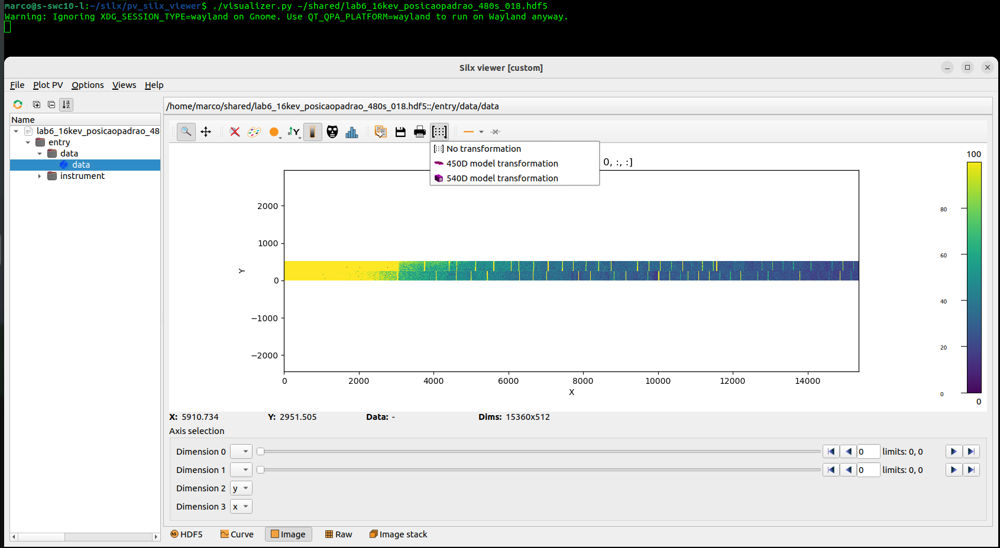
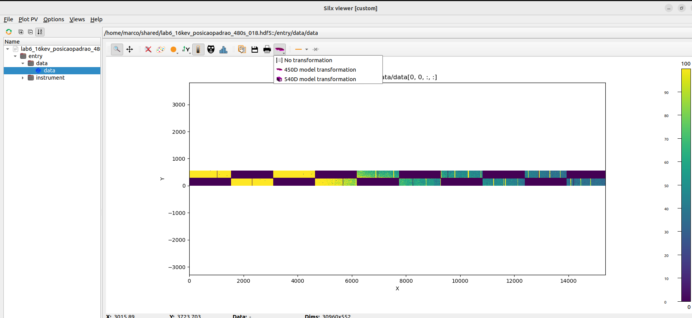
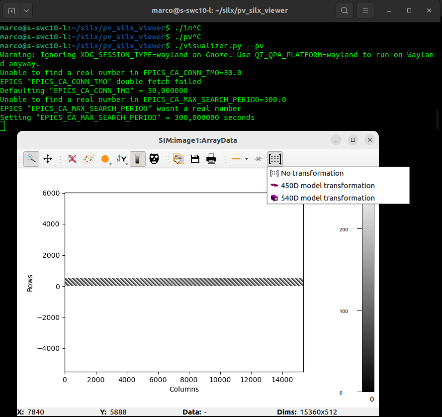
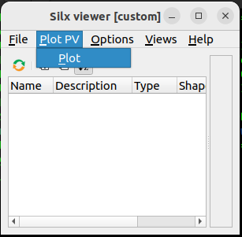

# Silx-based visualizer with custom image transformations.

This is an attempt to make a generic visualizer both for PV arrays and files where you can easily add custom image transformations. It has its limitations, but gets the job done for simple transformations.

I tried to make it pip-installable but still recommend using the ./pv_silx_viewer/visualizer.py file directly. For some reason, importing it into your script and doing pv_silx_viewer.main(sys.argv) segfaults in application exit.

You can use the ./environment.yml file to create a micromamba environment with all its dependencies. Honestly, its easier than installing it via pip.

For a better deploy, maybe check the comments in example_init.sh about plotting either PVs or Files by default.

## Visualizing a file:

```
./visualizer.py <path_to_file>
```

will open an application almost identical to silx viewer, but with the transformation options:



Clicking the transformation will apply it to the images. If you want no transformation, return the option to "No transformation":



## Visualizing a PV as an image:

For areaDetector array PVs, you can simply click on the "Plot PV" button after application start.

Alternatively, if you want to start it directly on PV visualizer mode bypassing the file viewer, use:

```
./visualizer.py --pv
```

The transformations will also be available.

The PV to be visualized can be defined in three ways: in the defaults.yml file, with the --prefix, --width-suffix and --height-suffix options and finally as environment variables: ARRAY_PREFIX, WIDTH_PREFIX and HEIGHT_PREFIX.

I recommend simply changing "SIM:image1:" int the defaults.yml file to your actual prefix.




## Adding your custom transformation:

To add your custom transformation:

1 - In ./pv_silx_viewer/icons, put a nice icon to represent it. <br/>
2 - In ./pv_silx_viewer/TransformToolButton.py, define a function that receives a numpy array representing your data as argument and returns the transformed data. Use the function "pimega450DTrans" and "noTrans" as examples. <br/>
3 - In TransformToolButton.__init__, add your transformation to the self.STATE dictionary. "icon" is the icon path. "state" is the transformation name. "action" is the text that will show up for the user. <br/>
4 - Add your action inside TransformToolButton.createAllActions following the pattern. <br/>
5 - In TransformToolButton.setTransformation, link the action with the transformation function following the pattern (something like: plot.transformation = myTransformationFunction) 
