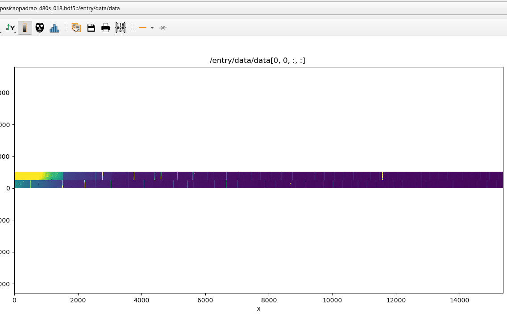
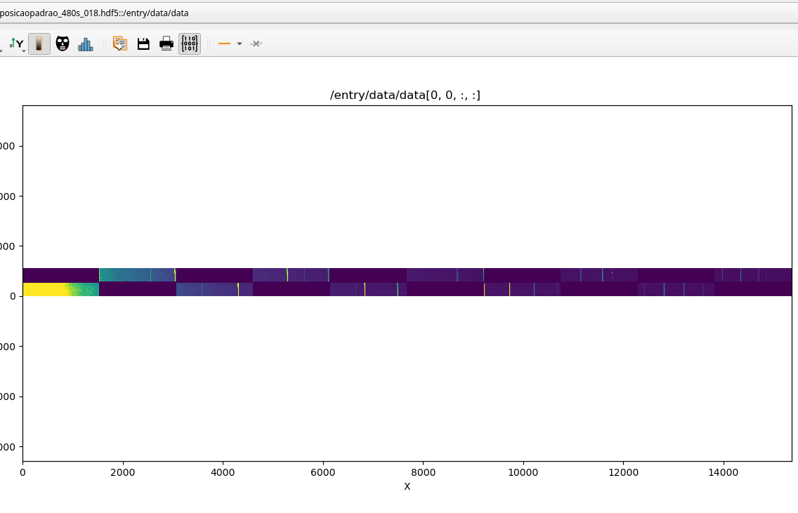

# Silx-based visualizer for PiMega images.

## Installation and usage:

```
micromamba create -f ./environment.yml
```

```
micromamba activate visualizer
./visualizer.py [FILEPATH]
```

By clicking on the matrix button, you can make it restore images with the SSCPimega restoration package. For now, PIMEGA450D restoration is hardcoded. it can be improved in the future.


